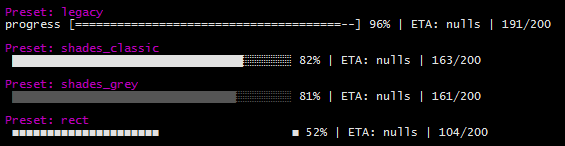

CLI-Progress
============
Easy to use Progress-Bar for Command-Line/Terminal Applications

```bash
$ npm install cli-progress
```


Presets
-------


Features
--------

* **Simple**, **Robust** and **Easy** to use
* Full customizable output format (various placeholders are available)
* Custom Bar Characters
* FPS limiter
* ETA calculation based on elapsed time
* Only visible in TTY environments
* No callbacks required - designed as pure, external controlled UI widget
* Works in Asynchronous and Synchronous tasks
* Preset/Theme support

*Successful tested on Windows10, Debian 8 and Ubuntu 14,15,16*

Installation
------------

You can install cli-progress with [NPM](http://www.npmjs.com/package/cli-progress)

```bash
$ npm install cli-progress
$ yarn add cli-progress
```

Or manually from the [GitHub Repository](https://github.com/AndiDittrich/Node.CLI-Progress/releases/latest)

```bash
$ wget https://github.com/AndiDittrich/Node.CLI-Progress/archive/v1.4.0.tar.gz
```

Progress-Bar
------------

### Getting Started ###

You can find some basic examples in [example.js](https://github.com/AndiDittrich/Node.CLI-Progress/blob/master/example.js) - just run the file with `$ node example.js` 

### Usage ###

```js
var _progress = require('cli-progress');

// create a new progress bar instance and use shades_classic theme
var bar1 = new _progress.Bar({}, _progress.Presets.shades_classic);

// start the progress bar with a total value of 200 and start value of 0
bar1.start(200, 0);

// update the current value in your application..
bar1.update(100);

// stop the progress bar
bar1.stop();
```

### Methods/Syntax ###

#### Constructor ####

Initialize a new Progress bar. An instance can be used **multiple** times! it's not required to re-create it!

```js
var <instance> = new namespace.Bar(options:object, preset:object);
```

#### start() ####

Starts the progress bar and set the total and initial value

```js
<instance>.start(totalValue:int, startValue:int);
```

#### update() ####

Sets the current progress value

```js
<instance>.update(currentValue:int);
```

#### increment() ####

Increases the current progress value by a specified amount (default +1)

```js
<instance>.increment(delta:int);
```

#### stop() ####

Stops the progress bar and go to next line

```js
<instance>.stop();
```


### Bar Formatting ###

The progressbar can be customized by using the following build-in placeholders. They can be combined in any order.

- `{bar}` - the progress bar, customizable by the options **barsize**, **barCompleteString** and **barIncompleteString**
- `{percentage}` - the current progress in percent (0-100)
- `{total}` - the end value
- `{value}` - the current value set by last `update()` call
- `{eta}` - expected time of accomplishment in seconds
- `{duration}` - elapsed time in seconds
- `{eta_formatted}` - expected time of accomplishment formatted into appropriate units
- `{duration_formatted}` - elapsed time formatted into appropriate units

#### Example ####

```
progress [{bar}] {percentage}% | ETA: {eta}s | {value}/{total}
```

is rendered as

```
progress [========================================] 100% | ETA: 0s | 200/200
```

### Options ###

- `format` (type:string) - progress bar output format @see format section
- `fps` (type:float) - the maximum update rate (default: 10)
- `stream` (type:stream) - output stream to use (default: `process.stderr`)
- `stopOnComplete` (type:boolean) - automatically call `stop()` when the value reaches the total (default: false)
- `clearOnComplete` (type:boolean) - clear the progress bar on complete / `stop()` call (default: false)
- `barsize` (type:int) - the length of the progress bar in chars (default: 40)
- `barCompleteString` (type:char) - character to use as "complete" indicator in the bar (default: "=")
- `barIncompleteString` (type:char) - character to use as "incomplete" indicator in the bar (default: "-")
- `hideCursor` (type:boolean) - hide the cursor during progress operation; restored on complete (default: false)
- `etaBuffer` (type:int) - number of updates with which to calculate the eta; higher numbers give a more stable eta (default: 10)

#### Example ####

```js
// change the progress characters
// set fps limit to 5
// change the output stream and barsize
var b2 = new _progress.Bar({
    barCompleteChar: '#',
    barIncompleteChar: '.',
    fps: 5,
    stream: process.stdout,
    barsize: 65
});
```

Presets/Themes
---------------------------------------------

Need a more modern appearance ? **cli-progress** supports predefined themes via presets. You are welcome to add your custom one :)

But keep in mind that a lot of the "special-chars" rely on Unicode - it might not work as expected on legacy systems.

### Default Presets ###

The following presets are included by default

* **legacy** - Styles as of cli-progress v1.3.0
* **shades-classic** - Unicode background shades are used for the bar
* **shades-grey** - Unicode background shades with grey bar
* **rect** - Unicode Rectangles

Any Questions ? Report a Bug ? Enhancements ?
---------------------------------------------
Please open a new issue on [GitHub](https://github.com/AndiDittrich/Node.CLI-Progress/issues)

License
-------
CLI-Progress is OpenSource and licensed under the Terms of [The MIT License (X11)](http://opensource.org/licenses/MIT). You're welcome to [contribute](https://github.com/AndiDittrich/Node.CLI-Progress/blob/master/CONTRIBUTE.md)!